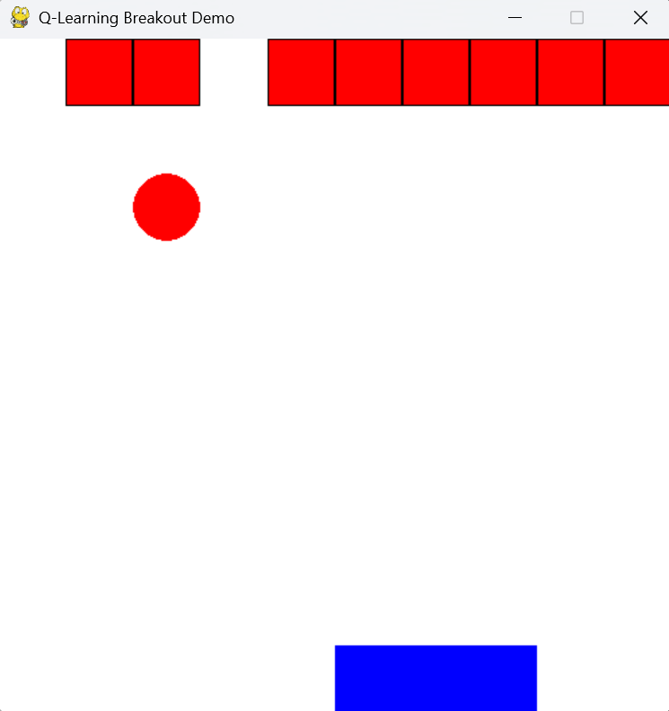
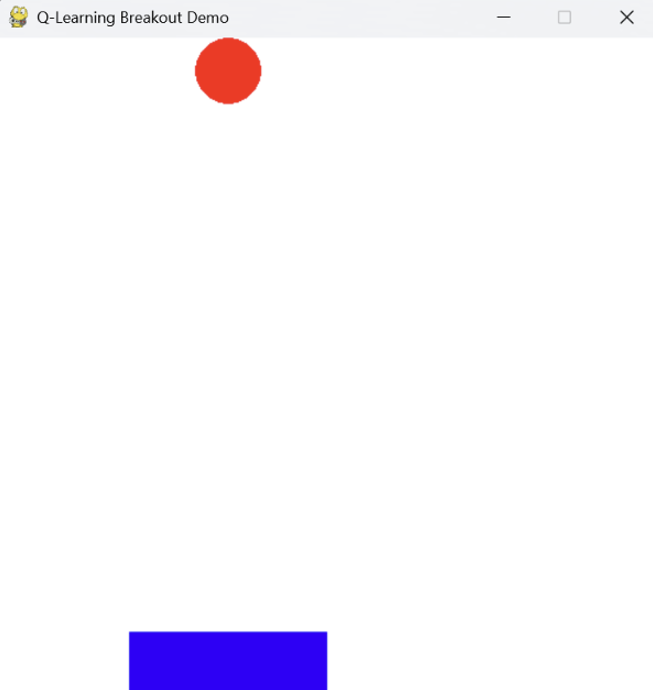
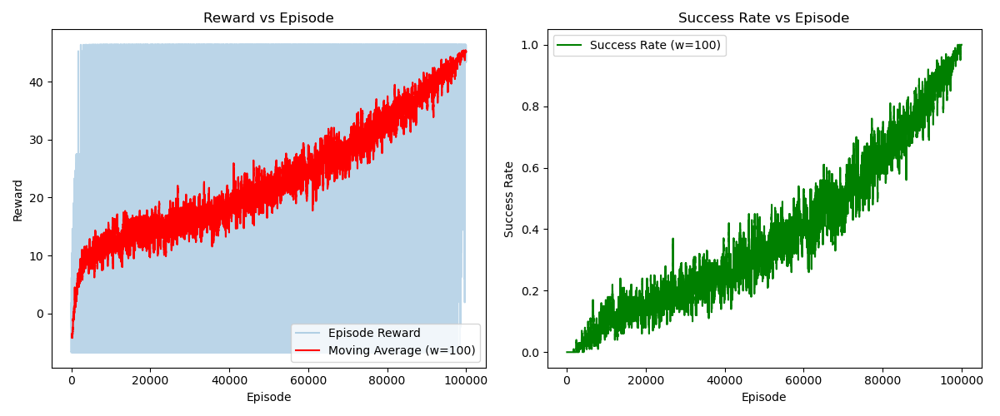
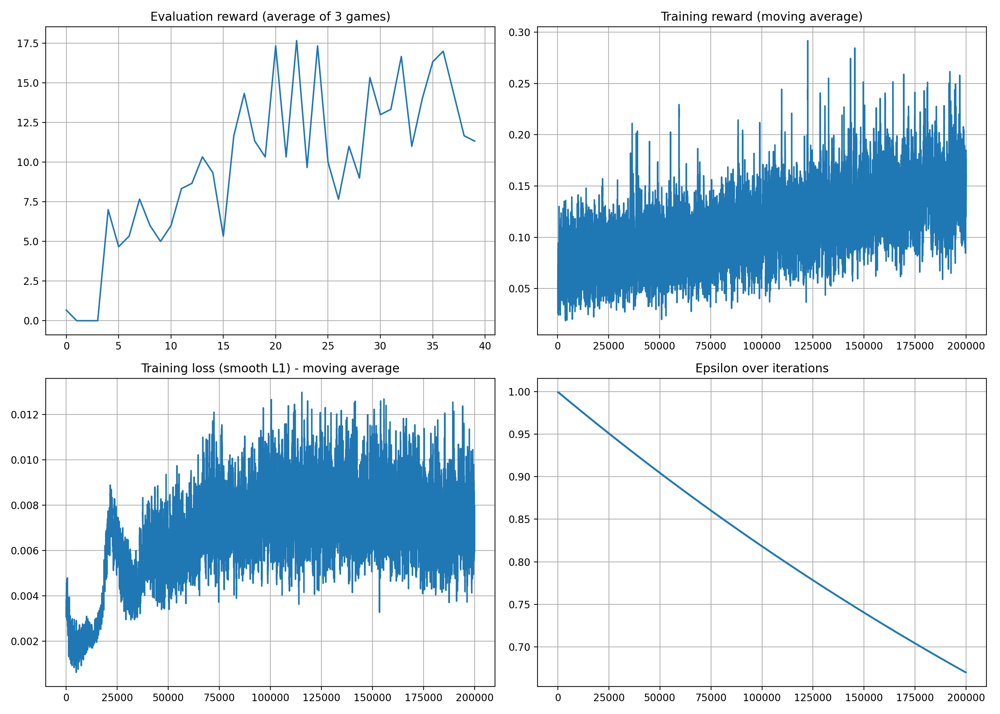

# Breakout

This project is continuing in V2, implement value-based methods including Q-learning and DQN, to try to find a final solution. 

This is one of two parts of my Tufts University's Reinforcement Learning course's final project. This project focus on value-based methods, while another one focus on policy-based methods: [Walker2d](https://github.com/jeffliulab/walker2d)

## Prototype to evaluate Q-learning

This part is a simplified prototype of the Breakout game environment designed to evaluate the performance of Q-learning in a discrete setting. The game is implemented on a 10x10 grid, featuring a paddle, ball, and bricks. The paddle is fixed at the bottom, the ball moves with a fixed vertical velocity and a random horizontal direction, and the bricks are arranged in a single row at the top.

The demo's running graph is:
- 

After learning, the agent can successfully play the game and eliminate all the bricks:
- 

The learning curve is shown below:
- 

### Environment Details
- **Grid**: 10x10 discrete grid.
- **Paddle**: Fixed on the bottom row with a width of 3 cells; can move left or right.
- **Ball**:
  - Starts directly above the paddle at a random horizontal position within the paddle's range.
  - Has an initial upward vertical velocity (-1) and a random horizontal velocity (-1 or 1).
- **Bricks**: Placed in the top row; represented by a 10-bit binary number where each bit indicates the presence of a brick.

### Q-Learning Agent
The Q-learning agent learns to play the game by interacting with the environment and updating its Q-table based on the rewards received:
- **Actions**:
  - `0`: No movement.
  - `1`: Move paddle left.
  - `2`: Move paddle right.
- **Reward Structure**:
  - **Step penalty**: -0.1 per move.
  - **Brick hit**: +5 reward (brick is removed and the ball's direction is reversed).
  - **Paddle hit**: +1 reward when the ball is successfully returned.
  - **Game loss**: -10 reward if the ball falls below the paddle.
  - **Game win**: +10 reward when all bricks are removed.

### Project Structure
- **BreakoutEnv**: Implements the game environment, handling paddle, ball, and brick initialization, state updates, collision detection, and reward computation.
- **BreakoutRenderer**: Uses Pygame to render the game state graphically, providing visual feedback during training or demonstration.
- **QLearningAgent**: Implements the Q-learning algorithm with methods to choose actions (using an epsilon-greedy strategy), update Q-values, and train the agent over multiple episodes.
- **Learning Curves**: Uses Matplotlib to plot rewards and success rates per episode, helping visualize the learning progress over time.
- **Main Function**: Integrates all components:
  1. Initializes the game environment and Q-learning agent.
  2. Trains the agent on the environment.
  3. Demonstrates the trained policy using a graphical interface.
  4. Plots the training progress.

### Dependencies
Please ensure that you have the following Python libraries installed:
- [Pygame](https://www.pygame.org/)
- [NumPy](https://numpy.org/)
- [Matplotlib](https://matplotlib.org/)

Install the dependencies using **`pip install pygame numpy matplotlib`**.

### Running the Prototype
Run the main script with **`python main.py`**. This command will:
1. Train the Q-learning agent in the Breakout environment.
2. Launch the Pygame graphical demo to showcase the learned policy.
3. Display learning curves after training.

### Parameter Configuration
- **Training Episodes**: Adjust the number of episodes by modifying `num_episodes` in `q_agent.train(env, num_episodes=100000)`.
- **Learning Rate, Discount Factor, and Initial Epsilon**: These parameters can be configured in the `QLearningAgent` constructor (`alpha`, `gamma`, `initial_epsilon`).
- **Rendering Settings**: Change the grid size and frame rate in the `BreakoutRenderer` to tailor the visual experience.

### Conclusion
This prototype provides a practical example for evaluating Q-learning in a simplified gaming environment. It is a useful foundation for further experiments and can be extended or modified for additional reinforcement learning research and applications.

### License
This project is licensed under the MIT License.

## End-to-End DQN Training

## End-to-End DQN Training

Through the principles described in the earlier prototype, it is not too difficult to find an optimal solution with Q-learning if we simplify the game state (for example, tracking the ball’s distance and angle relative to the paddle). However, in the original Breakout environment with raw pixel observations, manually extracting the ball or paddle positions can be quite difficult and error-prone. After studying DeepMind’s seminal work, I decided to adopt an **end-to-end** approach—no longer identifying the ball position explicitly but using the entire game screen as the state.

Under these circumstances, traditional tabular Q-learning fails because the state space becomes astronomically large (every possible screen). The only feasible option is to use a **Deep Q-Network (DQN)** to approximate \( Q(s, a) \) directly from pixel inputs.

### Why End-to-End?

1. **Minimal Feature Engineering**  
   We do not need to handcraft or detect in-game objects (like the ball). The agent processes raw frames directly.

2. **Convolutional Architecture**  
   By feeding frames (e.g., 84×84 grayscale images) into a CNN, the network learns to extract key features. This drastically reduces the dimensionality from thousands of pixels to a more compact latent representation.

3. **Scalable to Atari**  
   This approach, pioneered by DeepMind, generalizes well across many Atari games, avoiding the need to write specialized “ball detection” code for each environment.

### Method Overview

1. **Frame Preprocessing**  
   - Convert raw RGB frames to grayscale.  
   - Resize to 84×84.  
   - Stack a few consecutive frames (e.g., 4) to capture motion.

2. **Q-Network**  
   - A convolutional network extracts visual features, followed by fully connected layers outputting Q-values for each possible action (e.g., left, right, no-op, fire).  

3. **Experience Replay**  
   - Interact with the environment and store transitions \((s, a, r, s', \mathrm{done})\) in a replay buffer.  
   - Sample mini-batches from this buffer to decorrelate consecutive observations and stabilize updates.

4. **Target Network**  
   - Maintain a separate, periodically updated target network \( Q_\text{target} \).  
   - The TD target for each transition is  
     $$
     y = r + \gamma \max_{a'} Q_{\text{target}}(s', a').
     $$
   - This prevents the online network from immediately chasing its own moving targets.

5. **Optimization**  
   - Minimize the Huber loss (smooth L1) between the current Q-values and the TD targets.  
   - Update weights via backpropagation on each mini-batch.  
   - Over time, the network converges to approximate \( Q^*(s,a) \).

### Training Curve

A typical learning curve might show the **evaluation score** (e.g., average episode reward) increasing as training progresses. For instance:

- **X-axis**: Number of training iterations or environment steps.  
- **Y-axis**: Average return (e.g., total reward) over multiple test episodes.

### Implementation Notes

- **Hyperparameters**  
  - **Replay Buffer Size**: Often set to a large value (e.g., 1e5 or 1e6) to ensure diverse samples.  
  - **Learning Rate**: Values around \(1 \times 10^{-4}\) or \(2.5 \times 10^{-4}\) are common in Atari.  
  - **Batch Size**: Often 32 or 64.  
  - **\(\epsilon\)-Greedy**: Start with \(\epsilon = 1.0\), decay to 0.01 or 0.1 over millions of steps.  

### Conclusion

By training a convolutional neural network end-to-end on raw Breakout frames, we can learn effective policies that rival human-level performance. The agent does not need explicit detection of game objects—simply feeding in pixel data is sufficient, thanks to **Deep Q-Learning** techniques like experience replay, a target network, and careful tuning of hyperparameters.
