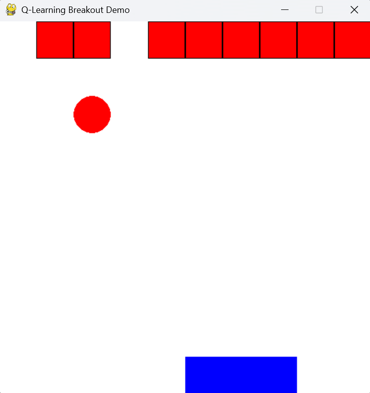
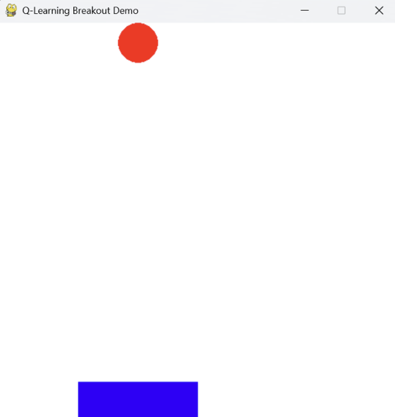
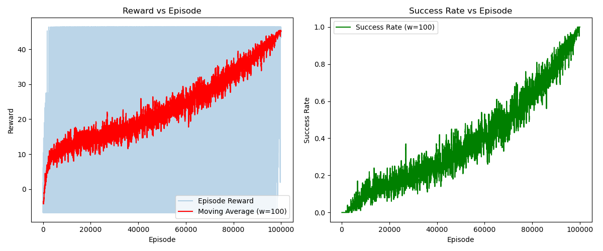
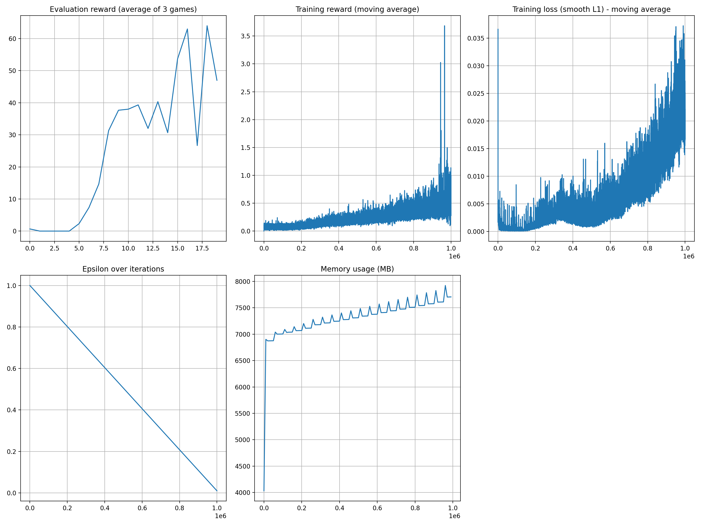
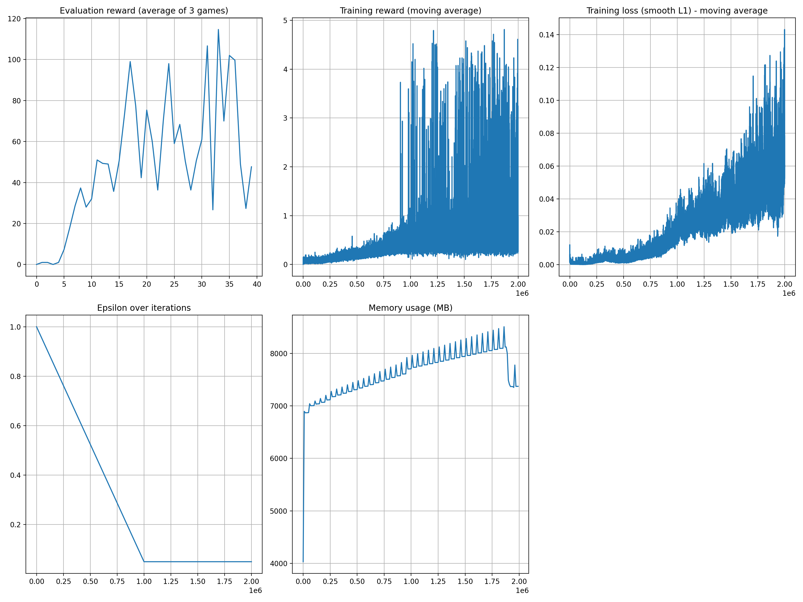
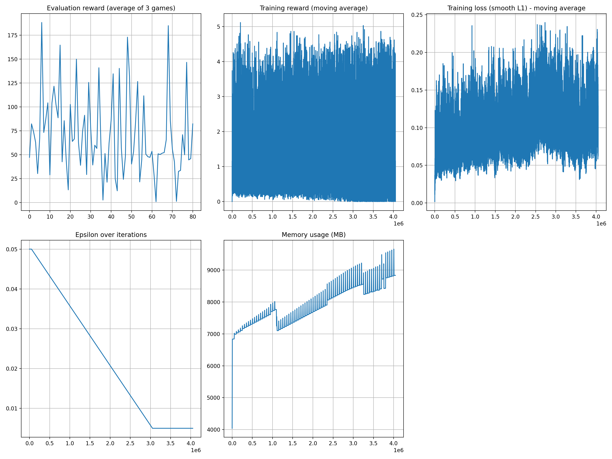
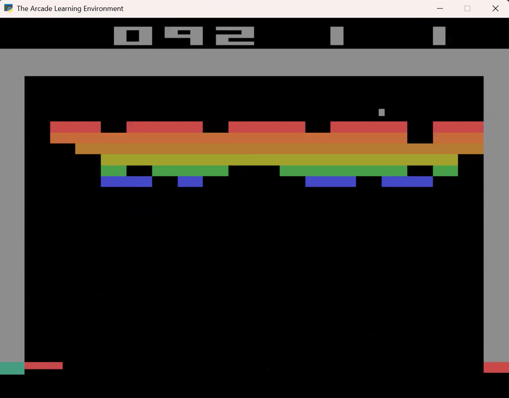
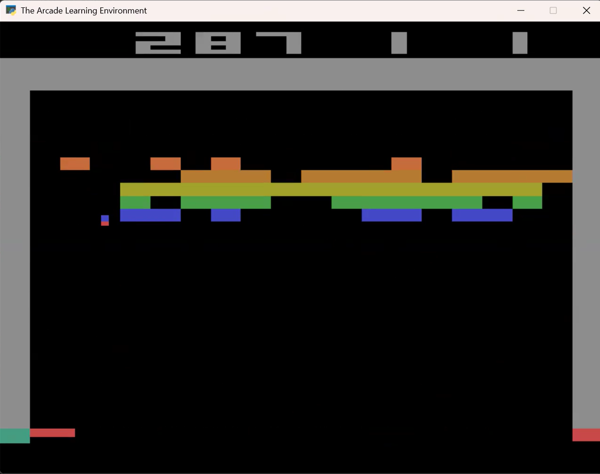

# Reinforcement Learning Final Report
## From Simplified to Complete Atari Breakout: A Practical Implementation with Q-Learning and Deep Q-Networks

**Pang Liu**  
*May 6, 2025*

## Links of Video Demo and Source Codes

**Video of demonstration:** [https://youtu.be/bV3nYO7sIQY](https://youtu.be/bV3nYO7sIQY)

**Video of the highest score (287):** [https://youtu.be/3Quh8cz5umc](https://youtu.be/3Quh8cz5umc)

**Source codes at GitHub:** [https://github.com/jeffliulab/rl_brick_game](https://github.com/jeffliulab/rl_brick_game)

## 1. Introduction

This report presents a comprehensive reinforcement learning solution for the Atari game Breakout, ranging from a simplified version to the complete implementation. I employ traditional Q-learning and Deep Q-Networks (DQN) to address this classic reinforcement learning challenge while documenting the encountered obstacles and significant results.

Traditional Q-learning cannot be directly applied to Atari games due to their extremely large state spaces. To overcome this limitation, I specifically designed a simplified version of Breakout using PyGame. For the original Breakout, I referenced DQN solutions, particularly incorporating several renowned papers from DeepMind. Due to the computational demands of training DQN on a laptop, I utilized AI tools such as ChatGPT and Claude to optimize CUDA usage and memory management. All code sources are thoroughly documented in my original implementation.

While numerous DQN solutions for Breakout are available through the Internet, most are compatible with earlier gym versions and using Tensorflow rather than the latest gymnasium (breakout-v5) with PyTorch. Therefore, from an educational perspective, my work provides a valuable reference for those learning reinforcement learning foundations nowadays.

Finally, I will conduct a targeted analysis of the high scores in the game, find the reasons for the high scores, and think about ways to further optimize them in the future.

## 2. Simplified Breakout Game with Traditional Q-Learning

### 2.1 Problem Description and Environment Setup

Breakout is a classic game where the player controls a paddle to bounce a ball and break bricks at the top of the screen. Theoretically, this represents a traditional tabular problem: the ball has position information, direction information, and velocity information at each moment. We can construct a large Q-table to store all this information.

The ball's state consists of position (x, y) and velocity vector (direction, speed), while the paddle's action space includes only three possibilities: move left, stay still, or move right. In principle, we could record all ball states corresponding to actions and solve the problem using a Q-table. However, the state space calculation reveals that this approach is impractical for the full game:

State Space = X_ball × Y_ball × V_x × V_y × X_paddle × Bricks

For a standard Atari Breakout game with a screen resolution of 160×210 pixels, multiple rows of bricks, and variable ball speeds, the state space would be on the order of 160 × 210 × 10 × 10 × 160 × 2^128 ≈ 10^45 states. This astronomical state space is far too large for tabular Q-learning.

To verify the feasibility of Q-learning—though it has been extensively validated by others—I designed a highly simplified version of Breakout starting from low-level code. This version uses a 10×10 grid, with the ball moving at a constant speed, thus significantly reducing the state space to:

State Space = 10 × 10 × 2 × 2 × 8 × 11 = 35,200 states

Where:
- Ball x-position: 10 possible values (0-9)
- Ball y-position: 10 possible values (0-9)
- Ball x-velocity: 2 possible values (-1, 1)
- Ball y-velocity: 2 possible values (-1, 1)
- Paddle position: 8 possible values (0-7, for a paddle of width 3 on a 10-unit grid)
- Brick count: 11 possible values (0-10 bricks)

This presents a manageable learning task that can be successfully tackled with tabular Q-learning.

### 2.2 State and Action Space

#### 2.2.1 State Space

The state is represented by a tuple capturing the key elements of the game:

S = (ball_x, ball_y, v_x, v_y, paddle_x, brick_count)

where:
- ball_x, ball_y: The position of the ball on the 10×10 grid.
- v_x, v_y: The ball's velocity components (-1 or 1 for each).
- paddle_x: The leftmost position of the paddle (0 to 7).
- brick_count: The number of bricks remaining at the top row (0 to 10).

The implementation uses a binary representation for the bricks, where each of the 10 positions in the top row can have a brick present (1) or absent (0), represented by a bit mask. This allows for efficient tracking of brick states during gameplay.

#### 2.2.2 Action Space

There are three possible actions for the paddle:
- **0:** No movement.
- **1:** Move paddle left.
- **2:** Move paddle right.

### 2.3 Reward Setting

The reward design in the simplified Breakout game is as follows:
- A small step penalty of -0.1 per move to encourage efficient solutions.
- A reward of +5 when the ball hits a brick (and the brick is removed).
- A reward of +1 when the ball hits the paddle.
- A final reward of +10 if all bricks are cleared (victory).
- A penalty of -10 if the ball is lost (falls below the paddle).

This reward structure encourages the agent to keep the ball in play, break bricks, and ultimately clear all bricks with minimum steps.

### 2.4 Q-learning Implementation

The Q-learning algorithm is implemented with an ε-greedy strategy with linear decay, where ε starts at 0.2 and gradually decreases to 0 over the course of training. The Q-values are stored in a dictionary where keys are state tuples and values are lists of action values.

The update rule follows the standard Q-learning formula:

Q(s,a) ← Q(s,a) + α[r + γ max_a' Q(s',a') - Q(s,a)]

Here:
- α = 0.1 is the learning rate.
- γ = 0.99 is the discount factor.
- r is the reward received after taking action a in state s.
- s' is the next state.
- max_a' Q(s',a') represents the maximum Q-value for the next state.

The agent was trained for 100,000 episodes, during which the exploration rate ε was linearly decreased from 0.2 to 0 to balance exploration and exploitation. Training progress was monitored every 1,000 episodes by recording the average reward and success rate.

### 2.5 Experimental Results and Visualization

The implementation includes a graphical interface using Pygame to visualize the game environment and the agent's performance. Figure 1 shows the game in progress with red bricks at the top, a blue paddle at the bottom, and a red ball.

**Figure 1:** Breakout game in progress. The red blocks at the top represent bricks, the blue rectangle at the bottom represents the paddle, and the red circle represents the ball.

**Figure 2:** Breakout game after successfully clearing all bricks, demonstrating that the agent has learned an effective policy.

After completing the training, the agent demonstrated its ability to successfully play the game and clear all bricks, as shown in Figure 2. The learning progression was tracked through episode rewards and success rates.

Figure 3 displays the learning curves for the Q-learning agent. The left graph shows the episode rewards (blue) and their moving average (red), while the right graph shows the success rate (green) over the training episodes. The success rate is defined as the proportion of episodes where the agent managed to clear all bricks.

**Figure 3:** Learning curves for the Q-learning agent in the simplified Breakout environment. Left: episode rewards and their moving average. Right: success rate over training episodes.

The learning curves demonstrate that the Q-learning agent successfully learned to play the simplified Breakout game. Initially, the rewards were low and highly variable, but as training progressed, the agent achieved consistently higher rewards and an increasing success rate. By the end of training, the agent was regularly achieving successful brick clearance, demonstrating that traditional Q-learning can effectively solve this reduced-complexity version of the Breakout game.

This experiment confirms the theoretical feasibility of using tabular Q-learning for the Breakout task when the state space is manageable. However, for the full-scale Atari Breakout game with a much larger state space, more sophisticated approaches such as Deep Q-Networks (DQN) are necessary, which we will explore in the next section.

## 3. Atari Breakout with DQN Solution

### 3.1 Motivation for Deep Q-Networks

In the previous section, we successfully demonstrated that Q-learning can solve a simplified version of the Breakout game with a manageable state space. However, when tackling the actual Atari Breakout game, we face a significantly more challenging scenario due to the enormous state space. The standard Atari games operate at a resolution of 160×210 pixels, with each pixel potentially having multiple color values. If we were to represent the state directly, the resulting state space would be astronomical (on the order of 10^45 possible states), making tabular Q-learning completely impractical.

Deep Q-Networks (DQN) address this challenge by using deep neural networks as function approximators to estimate the Q-values from high-dimensional sensory inputs. DQN enables end-to-end reinforcement learning, where the agent learns directly from raw pixel inputs without requiring hand-engineered features. This approach was pioneered by DeepMind in their groundbreaking 2015 Nature paper, which demonstrated human-level performance on 49 Atari 2600 games.

A key advantage of DQN is its end-to-end learning capability. Unlike the simplified Q-learning approach that required explicit state representation, DQN learns directly from raw pixel inputs. This is particularly valuable for the Atari Breakout environment where:

- The state space is extremely large (raw pixels)
- The exact positions of game elements (ball, paddle, bricks) are not directly accessible
- The relationship between visual input and optimal actions is complex

This end-to-end approach eliminates the need for manual feature engineering and allows the network to discover relevant features automatically through training.

### 3.2 State and Action Space for Atari Breakout

For the full Atari Breakout environment:

#### 3.2.1 State Space

Unlike the simplified version where the state is represented by a small tuple of game elements, the DQN approach uses pre-processed screen pixels as input:
- **Raw Input**: 160×210 RGB pixel values from the Atari emulator
- **Pre-processed Input**: 84×84 grayscale images, normalized to [0,1]
- **Stacked Frames**: 4 consecutive frames stacked together to capture motion information (resulting in a 4×84×84 tensor)

The pre-processing pipeline involves:
1. Cropping the image to remove score displays and irrelevant areas (from 210 to 160 pixels in height)
2. Resizing to 84×84 pixels
3. Converting to grayscale to reduce dimensionality
4. Normalizing pixel values to the range [0,1]
5. Stacking 4 consecutive frames to provide temporal information

#### 3.2.2 Action Space

The Atari Breakout environment provides 4 discrete actions:
- **0**: NOOP (no operation)
- **1**: FIRE (start the game/launch a new ball)
- **2**: RIGHT (move paddle right)
- **3**: LEFT (move paddle left)

### 3.3 DQN Architecture and Implementation

#### 3.3.1 Network Architecture

Following DeepMind's standard configuration, our DQN implements a convolutional neural network with:

- **Input Layer**: 4×84×84 tensor (4 stacked, pre-processed frames)
- **Convolutional Layers**:
  - Conv1: 32 filters of size 8×8 with stride 4, followed by ReLU
  - Conv2: 64 filters of size 4×4 with stride 2, followed by ReLU
  - Conv3: 64 filters of size 3×3 with stride 1, followed by ReLU
- **Fully Connected Layers**:
  - FC1: 512 units with ReLU activation
  - Output: Linear layer with 4 units (one for each action)

This architecture progressively extracts higher-level visual features from the raw pixel input, culminating in Q-value estimates for each possible action.

#### 3.3.2 Key DQN Techniques

Several crucial techniques are employed to stabilize training:

**Experience Replay Buffer**  
The agent stores transitions (s, a, r, s', done) in a replay buffer with capacity 70,000. During training, random batches of 64 experiences are sampled from this buffer, breaking the temporal correlation between consecutive samples and improving learning stability.

**Target Network**  
We maintain two separate networks:
- **Policy Network**: Updated every iteration through gradient descent
- **Target Network**: Periodically updated to match the policy network (every 500 iterations)

This stabilizes training by preventing the oscillation that would occur if the target values were constantly changing during updates.

**Epsilon-Greedy Exploration**  
The agent uses an ε-greedy policy with linear decay:
- Starting ε = 1.0 (100% random actions)
- Decay factor of 0.999 per target network update
- Minimum ε = 0.01 (1% random actions)

### 3.4 DQN Training Algorithm

The DQN algorithm implements the following update rule for Q-learning using temporal difference (TD) learning:

Loss = Huber(Q_policy(s,a) - y)  
y = r + γ max_a' Q_target(s',a') · (1 - done)

Where:
- Q_policy(s,a) is the Q-value from the policy network
- Q_target(s',a') is the Q-value from the target network
- r is the reward received
- γ = 0.99 is the discount factor
- done is a binary flag indicating whether the episode has terminated
- Huber is the Huber loss (smooth L1), which is less sensitive to outliers than squared error

The optimization process uses Adam optimizer with a learning rate of 10^-4 and includes gradient clipping to prevent exploding gradients.

### 3.5 Experimental Results

The DQN agent was trained for 200,000 iterations, with each iteration consisting of 10 environment interactions followed by a training step on a batch of 64 experiences. Figure 4 displays the learning curves.

**Figure 4:** DQN learning curves over 200,000 iterations. Top left: Evaluation reward (average of 3 games). Top right: Training reward (moving average). Bottom left: Training loss (moving average). Bottom right: Exploration rate (epsilon) decay.

Analysis of the results reveals:

- **Evaluation Reward**: The agent's performance improved significantly, reaching an average reward of over 15 points in the best evaluations. This corresponds to clearing multiple rows of bricks consistently.
    
- **Training Reward**: The moving average of rewards during training shows a gradual upward trend, indicating progressive learning.
    
- **Training Loss**: The loss initially increases as the agent discovers new state-action patterns, then stabilizes as learning progresses, showing that the neural network is converging to a stable solution.
    
- **Exploration Rate**: The epsilon parameter decays smoothly from 1.0 to approximately 0.67 over the 200,000 iterations, gradually shifting from exploration to exploitation.

The DQN agent successfully learned to play Atari Breakout directly from pixel inputs, demonstrating the power of deep reinforcement learning to address problems with enormous state spaces. While the performance does not yet match human expert level (which typically scores above 30 points), the learning trends indicate that extended training would likely yield further improvements.

## 4. Optimization on DQN

### 4.1 Motivation for Further Optimization

The results from the previous section demonstrate that the end-to-end DQN approach is indeed feasible for solving the Atari Breakout game. However, several challenges emerged during the implementation process:

- The standard training process for DQN typically requires millions of iterations to reach human-level performance, which is computationally intensive.
- Training on consumer-grade hardware (like my laptop) presents additional challenges such as memory constraints, thermal throttling, and the risk of training interruptions.

To address these issues, I leveraged AI tools such as ChatGPT and Claude to optimize the training environment and create a robust training script with checkpoint-based recovery capabilities. This allowed for extended training sessions that could be paused and resumed, making it possible to conduct experiments with 1 million, 2 million, and even 6 million training iterations on consumer hardware.

### 4.2 Memory Management and Training Resilience

The first major optimization focused on memory management and training resilience. The code was enhanced with several key improvements:

- **Memory monitoring and management**: Added functions to track memory usage and perform garbage collection when needed.
    
- **Memory-efficient replay buffer**: Modified the replay buffer to store frames as uint8 instead of float32, reducing memory usage by approximately 75%.
    
- **Adaptive batch sizing**: Implemented a system that automatically reduces batch size when memory issues are detected.
    
- **Training checkpoints**: Added functionality to save and load training progress, allowing for recovery after interruptions.

These optimizations made it possible to run extended training sessions on limited hardware while maintaining training stability.

### 4.3 Training with 1 Million Iterations

With the optimized training environment, I conducted a training session for 1 million iterations. Figure 5 shows the learning curves for this extended training.

**Figure 5:** DQN learning curves over 1 million iterations. Top left: Evaluation reward. Top right: Training reward (moving average). Bottom left: Training loss (moving average). Bottom right: Exploration rate (epsilon) decay.

The 1 million iteration training results show significant improvements over the 200,000 iteration baseline: the highest score exceeded 60 points and was able to stabilize at more than 30 points; the overall level of training rewards continued to improve steadily; the loss stabilized around 0.01 after an initial exploration phase, indicating good convergence properties.

### 4.4 Further Extensions to 2 Million Iterations

To investigate whether additional training would yield further improvements, I extended the training to 2 million iterations. Figure 6 shows the learning curves for this more extensive training session.

**Figure 6:** DQN learning curves over 2 million iterations. Shows continued improvement in performance beyond the 1 million iteration mark.

During the extended 2 million-iteration run, the Evaluation reward rose to over 100, and the overall performance level remained stable at over 40; the Training reward also rose to a higher level, showing a better performance level overall.

### 4.5 Pushing the Limits: 2-6 Million Iterations

After observing the promising results from the 2 million iteration training, I decided to push the boundaries further by extending the training to 6 million iterations. Due to the computational constraints of consumer hardware, this required significant code restructuring and optimization beyond what was implemented in the previous training phases.

**Figure 7:** DQN learning curves over extended training from 2 million to 6 million iterations. This training was resumed from the 2 million iteration checkpoint and continued with enhanced memory management and adaptive epsilon decay.

#### 4.5.1 Optimization in training environment

To support this extended training duration and sustain training across several days on limited hardware, I used AI tools to help me enhance the codes and implemented a more sophisticated code architecture with several specialized modules.

- **Modular Code Organization**: The monolithic implementation was split into specialized modules.
    
- **Enhanced Checkpoint System**: The revised checkpoint system included state preservation for policy networks, target networks, optimizer states, training histories, and configuration settings.
    
- **Command-line Interface**: Added support for CLI arguments to specify checkpoint paths, iteration counts, and epsilon values.
    
- **Multi-Level Memory Monitoring**: Introduced tiered memory thresholds (80% warning, 85% action) with corresponding responses.
    
- **Dynamic Buffer Management**: The replay buffer automatically reduces its size when memory pressure is detected.
    
- **Tensor Management**: Added explicit tensor cleanup and CUDA synchronization.
    
- **Memory Leak Detection**: Implemented periodic memory leak tracking using the `tracemalloc` module to identify and address potential memory leaks during long training sessions.

#### 4.5.2 Advanced Epsilon Control Strategy

For this extended training, I implemented a more sophisticated epsilon decay strategy:

- **Three-Phase Epsilon Scheduling**: 
  1. **Initial Phase** (0-2M iterations): Maintained epsilon at 0.05 to preserve exploration
  2. **Decay Phase** (2M-5M iterations): Linear decay from 0.05 to 0.005
  3. **Final Phase** (5M-6M iterations): Fixed at 0.005 for fine-tuning

#### 4.5.3 Results and Analysis

After 6M training, the highest Evaluation reward can reach 175, which has reached the level of human players. At least when I play myself, I can't play every game to such a high score of 175, because the speed of the ball will be very fast in the high segment.

However, the limitations are also obvious. I think it has something to do with the size of my replay buffer space. I only used a replay buffer of 100,000, but for 6M training, the information I saw on the Internet generally requires a larger level, even a replay buffer of 1 million, but this level has exceeded the limit of my computer. In order to solve this problem, in addition to increasing the replay buffer, the Double DQN paper also shows a better improved DQN strategy, which uses a faster convergence speed to solve the problem of requiring a relatively large replay buffer.

## 5. A more in-depth analysis: High-scoring case studies

In Chapter 4, we used neural networks combined with Q-learning to achieve high-score cases, but according to the images, we can also clearly see that high scores are not common. So for the breakout game, under what circumstances can we get significantly high scores? Why is it difficult to sustain such high scores?

In Chapter 4, I analyzed the difficulty of sustaining high scores as insufficient computer hardware conditions, but after a deeper analysis, I found that things are not that simple.

After 1M training, as shown in Figure 5, the evaluation reward can be stabilized between 30-40, and some times it reaches more than 60; after 2M training, as shown in Figure 6, the evaluation reward can be stabilized between 40-80, but some times it reaches more than 100; and after 6M training, as shown in Figure 7, the evaluation reward becomes more unstable, most of the time it remains between 50-100, and a few times it can reach 175.

In order to explore the specific performance, I wrote the evaluate script, performed a visual evaluation analysis of different models, and found the reasons for some high scores. In Figure 8 and Figure 9, I showed two screenshots of a test scene, and you can see that the game reached 287 points, which is far higher than the average performance of the model. The reason is obvious. The agent accidentally created a "tunnel" through which the ball can enter the upper space, and to a certain extent, it can trap the ball in the upper space and knock down bricks on a large scale. After checking the game information online, I found that this is the game strategy of the game master, and the agent accidentally discovered this strategy and demonstrated the execution of this strategy in multiple tests. I evaluated about 50 games and found that the tunnel phenomenon appeared 5 times in my 50 simulations, indicating that this situation is not an isolated case. And I found that the agent always tends to hit the ball to one side (especially the left side) rather than the center in many cases. This strategy increases the possibility of the formation of the left tunnel to a certain extent. In other words, the agent has preliminarily discovered this strategy in 6M trainings and is moving closer to it.

**Figure 8:** This image shows the first half of a scene from one of the highest test score cases.

**Figure 9:** This screenshot shows a scene near the end of the highest test score case.

## 6. Conclusion

In this report, I have demonstrated a complete reinforcement learning pipeline for the Atari Breakout game, beginning with a highly simplified 10×10 grid environment solved via traditional tabular Q-learning and culminating in a full-scale Deep Q-Network (DQN) solution trained directly from raw pixel inputs. The simplified PyGame implementation confirmed that tabular methods can work when the state space is constrained, achieving consistent brick clearance within a manageable number of episodes. Transitioning to the full Atari environment, I employed the canonical DQN architecture—with experience replay, target networks, and ε-greedy exploration—to learn effective policies from high-dimensional visual observations. Through successive training phases (200 K, 1 M, 2 M, and up to 6 M iterations), with the help of AI tools' optimization in memory management and checkpoint resilience, the agent ultimately reaching human-level performance peaks (≈175 points) and uncovering emergent high‐score tunnel strategies.

The in-depth case study of high‐score episodes revealed that the agent, having been exposed to extensive training and optimized memory management, can discover advanced gameplay tactics akin to expert human strategies. Nevertheless, sustaining these high‐score runs remains challenging due to limitations in replay buffer capacity and the stochastic nature of exploration. Future work will explore enhanced DQN variants such as Double DQN, Prioritized Experience Replay, and Dueling Networks, as well as larger replay buffers or distributed training frameworks to further stabilize and accelerate learning. Overall, this practical implementation provides both a clear pedagogical path from tabular to deep methods and a robust foundation for advancing deep reinforcement learning research on complex, high-dimensional tasks.

## 7. References

- Mnih, V., Kavukcuoglu, K., Silver, D., Graves, A., Antonoglou, I., Wierstra, D., & Riedmiller, M. (2015). Playing Atari with Deep Reinforcement Learning. *Nature*, 518(7540), 529-533.
    
- Van Hasselt, H., Guez, A., & Silver, D. (2016). Deep Reinforcement Learning with Double Q-learning. *AAAI Conference on Artificial Intelligence*.
    
- Mnih, V., Puigdomènech Badia, A., Mirza, M., Graves, A., Harley, T., Lillicrap, T. P., Silver, D., & Kavukcuoglu, K. (2016). Asynchronous Methods for Deep Reinforcement Learning. *International Conference on Machine Learning*.
    
- Wang, Z., Schaul, T., Hessel, M., van Hasselt, H., Lanctot, M., & de Freitas, N. (2016). Dueling Network Architectures for Deep Reinforcement Learning. *International Conference on Machine Learning*.
    
- Berges, V., Rao, P., & Pryzant, R. Reinforcement Learning for Atari Breakout. *Stanford University CS 221 Project Paper*.
    
- Sutton, R. S., & Barto, A. G. (2018). *Reinforcement Learning: An Introduction* (2nd Edition). MIT Press.
    
- Schulman, J., Wolski, F., Dhariwal, P., Radford, A., & Klimov, O. (2017). Proximal Policy Optimization Algorithms. *arXiv preprint arXiv:1707.06347*.
    
- Schaul, T., Quan, J., Antonoglou, I., & Silver, D. (2016). Prioritized Experience Replay. *International Conference on Learning Representations*.
    
- Lin, L. J. (1992). Self-improving reactive agents based on reinforcement learning, planning and teaching. *Machine Learning*, 8(3-4), 293-321.
    
- Thrun, S., & Schwartz, A. (1993). Issues in using function approximation for reinforcement learning. *Proceedings of the Fourth Connectionist Models Summer School*, 255-263.
    
- Kaebling, L. P., Littman, M. L., & Moore, A. W. (1996). Reinforcement learning: A survey. *Journal of Artificial Intelligence Research*, 4, 237-285.